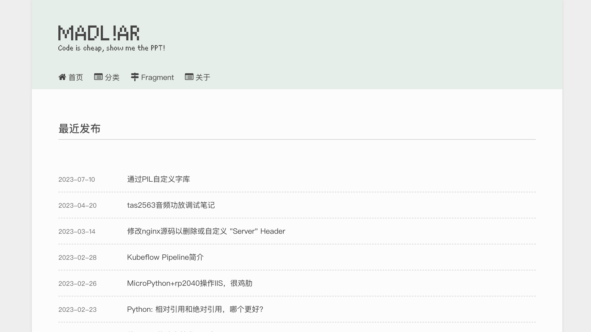
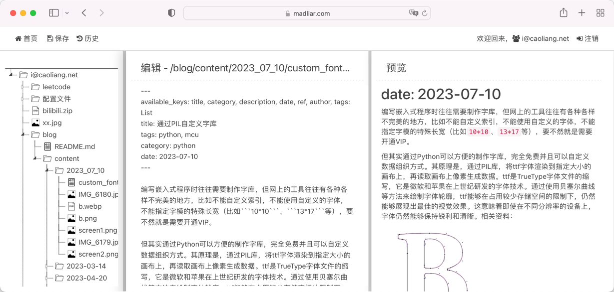
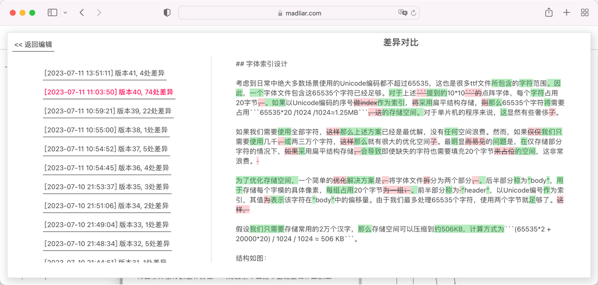
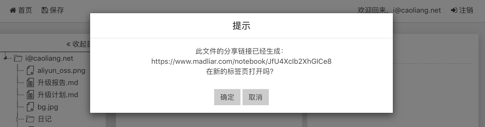

## Notebook

这是一个云笔记本，允许多用户注册使用。它附带目录结构，可以在线预览图片文件，并且保留编辑历史。此外，如果用户创建了一个名为"blog"的目录，还可以生成一个静态的博客。你还可以对这个项目进行魔改，添加ci支持，以便将其推送到web托管服务器或GitHub Pages上。示例地址：

This is a cloud notebook that allows multiple users to register and use. It comes with a directory structure, supports online preview of image files, and preserves editing history. Additionally, if a user creates a "blog" directory, it can generate a static blog. You can also modify this project and add CI support to push it to a web hosting server or GitHub Pages. Click here to view the example:

[](https://www.madliar.com)






## 架构

后端使用Fastapi构建，前端则基于jQuery。此工程依赖一个Redis，用作存储用户凭证，以及在某些操作上加全局锁。文件存储于本地目录"/data/storage"，但可以通过修改"data_io.py"文件来修改存储介质，比如s3存储。

### 开始使用

1. 安装redis，获得redis链接地址：`redis://:{redis_pass_word}@{host}:{port}/{db}`，对于默认的redis，这个地址为：`redis://:@localhost:6379/0`
2. 执行 `pip install -r reqirements.txt`
3. 执行 ```export REDIS_URL=redis://:@localhost:6379/0 && python run.py```

访问 http://localhost:10091/notebook 即可看到欢迎页。

---
本项目由GPLv3协议开源发布。This project is open source and released under the GPLv3 license.